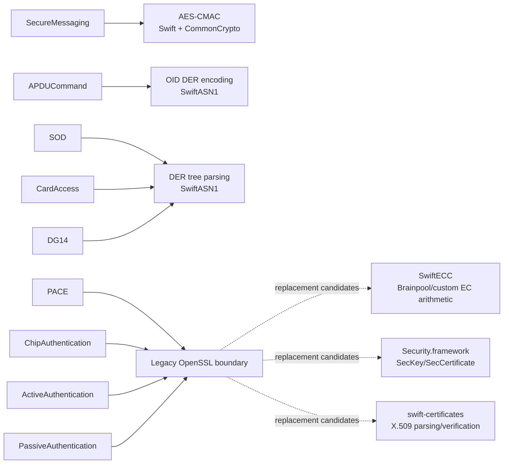
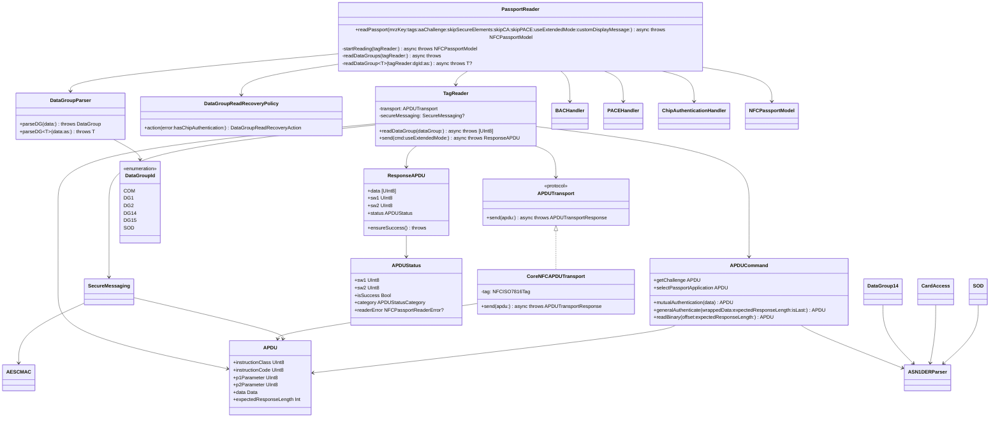
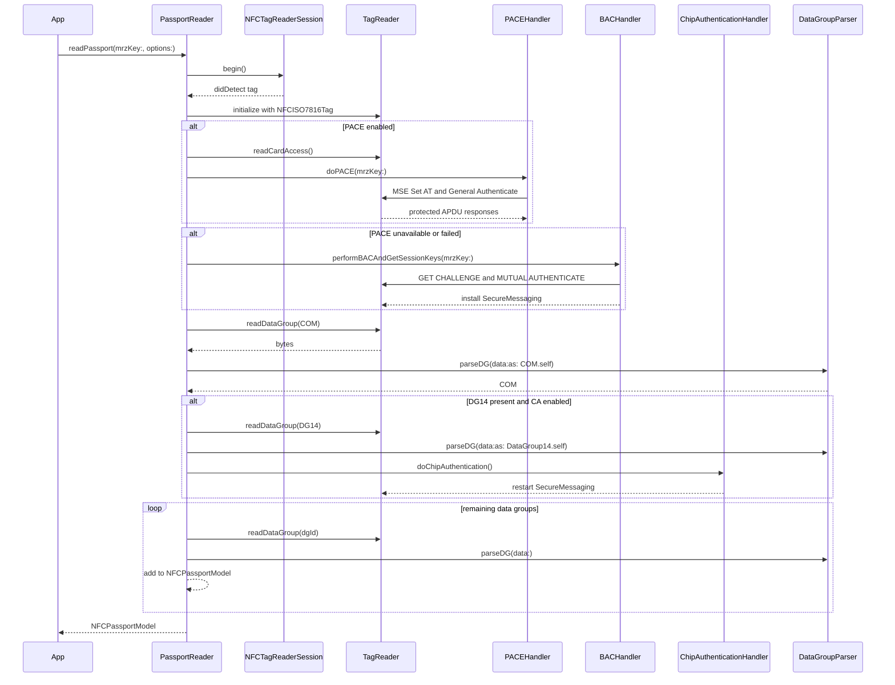
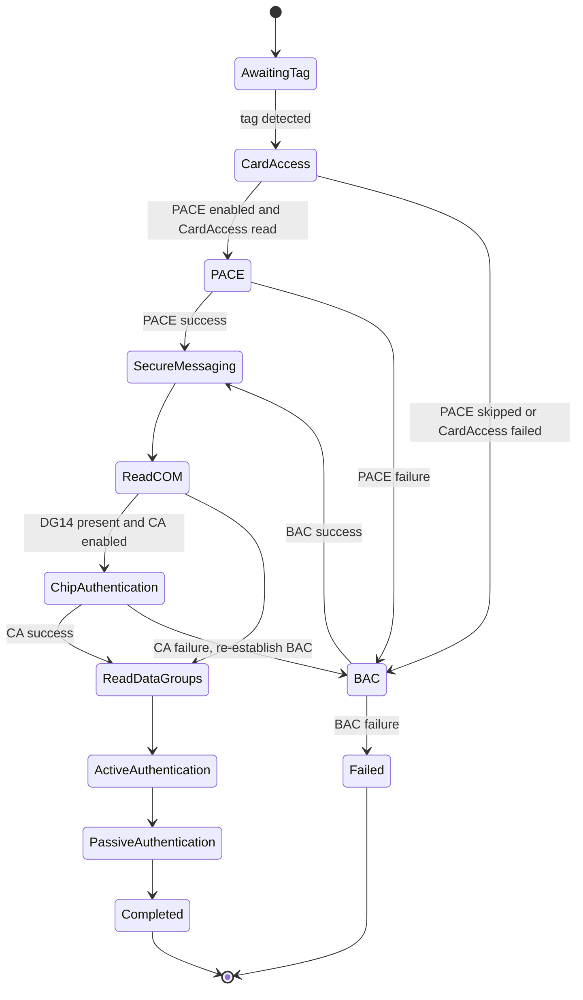

# NFCPassportReader Architecture

This package is being moved away from a direct Android-style port toward a Swift package shape with explicit protocol boundaries, small testable primitives, and clear ownership of NFC state. The `deluca` port is useful as a structural reference, especially around APDU, data-group, security, and documentation organization. It is not the behavioral source of truth for PACE or Chip Authentication because that implementation is incomplete there.

## Critical Review

The original package has several production risks:

- `TagReader` mixed APDU construction, secure messaging, transport, GET RESPONSE continuation, status-word decoding, and file reading.
- APDU failures were stringly typed and decoded in a private method, which made retry logic rely on exact English messages.
- `DataGroupParser` used parallel arrays for tags, display names, and concrete classes. That is fragile because a single ordering bug changes parser behavior.
- `PassportReader` owns NFC session state, authentication state, reading policy, retry policy, and model mutation. This is workable but too large for confident changes.
- The SwiftPM test target did not depend on the library target, so the package test scheme could not import `NFCPassportReader`.
- Crypto was concentrated behind OpenSSL C APIs, including deterministic primitives such as ASN.1/OID handling and AES-CMAC that have better Swift-native homes.

## Current Refactor

This pass keeps the public API and the existing PACE/Chip Authentication behavior intact while extracting Swift-native seams:

- `APDUCommand` centralizes APDU construction as typed factory methods.
- `APDUStatus` centralizes status-word interpretation and fixes success detection so both `0x90` and `0x00` are required.
- `ResponseAPDU.ensureSuccess()` gives callers a single, testable success gate.
- `DataGroupParser` now uses a typed registry keyed by `DataGroupId`.
- `DataGroupParser.parseDG(data:as:)` provides a generic concrete decoder and removes avoidable downcasts at call sites.
- `Package.swift` now makes `NFCPassportReaderTests` depend on `NFCPassportReader`, so the iOS test scheme is buildable.
- Apple `swift-asn1` now backs DER parsing and OID encoding instead of OpenSSL dump/OBJ helpers.
- AES-CMAC is implemented in Swift over CommonCrypto AES and covered by RFC 4493 test vectors.
- `APDUTransport` separates CoreNFC transceive calls from passport file-reading logic, making GET RESPONSE continuation and chunked reads testable with scripted APDU responses.
- `APDU`, `APDUCommand`, `ResponseAPDU`, `APDUStatus`, `SecureMessaging`, and `TagReader` now compile without CoreNFC; CoreNFC is an adapter at the hardware edge.
- `DataGroupReadRecoveryPolicy` replaces string-based retry decisions with typed APDU status categories and recovery actions.

## Crypto Direction

The target architecture is to make OpenSSL disappear from the reader core. The package now has a split between native deterministic primitives and the remaining legacy public-key/key-agreement surface:

Native now:

- DER parsing for CardAccess, DG14, SOD, and diagnostic SOD hash parsing.
- DER OID encoding for APDU `MSE:Set AT` and PACE public-key token generation.
- AES-CMAC for AES secure messaging and PACE authentication tokens.
- SHA-1/SHA-256/SHA-384/SHA-512 through CryptoKit and SHA-224 through CommonCrypto.

Still OpenSSL-backed:

- PACE and Chip Authentication key agreement, because the implementation needs DH, Brainpool curves, and PACE Generic Mapping with custom domain parameter mutation.
- Active Authentication public-key import and RSA/ECDSA verification, especially explicit-parameter EC keys.
- SOD certificate extraction, CMS signature verification, and CSCA/DSC trust-chain verification.

Replacement candidates:

- `Security.framework` for native RSA/ECDSA verification and `SecCertificate` handling where passports use platform-supported keys.
- Apple `swift-certificates` for Swift X.509 parsing and certificate-chain policy work.
- A reviewed EC arithmetic package such as `SwiftECC` for Brainpool and custom curve operations needed by PACE/Chip Authentication. Deluca does not solve this; it still uses OpenSSL for these operations.

## Package Class Diagram

## Read Sequence

## Authentication State

## Deluca Reference Decisions

Adopted:

- APDU command factories instead of constructing APDUs inline.
- APDU response/status decoding as a first-class concept.
- Data-group decoding registry instead of parallel arrays as the primary parser mechanism.
- Package documentation as part of the source tree.

Not adopted:

- Replacing the current PACE and Chip Authentication implementations, because the `deluca` versions are not complete for the flows this package already supports.
- Deluca's OpenSSL dependency strategy. It also keeps OpenSSL for AES-CMAC, PACE, Chip Authentication, and public-key handling.
- Removing recovery behavior around CA failure, BAC re-establishment, GET RESPONSE, and data-length fallback.

## Test Strategy

`swift test` on macOS now covers the CoreNFC-free reader core:

- APDU command construction and short/extended APDU parsing.
- APDU success/error mapping, including the fixed `0x90 0x01` non-success case.
- Invalid MRZ status mapping.
- Generic data-group parsing success and type-mismatch failure.
- Typed data-group read recovery for APDU status categories without string comparisons.
- Secure messaging protect/unprotect, including AES response checksum rejection.
- SwiftASN1 OID encoding and DER diagnostic dumps.
- AES-CMAC against RFC 4493 vectors.
- Scripted APDU transport coverage for GET RESPONSE continuation and chunked file reads.

The iOS simulator test scheme additionally covers package integration with CoreNFC available:

- Existing ASN.1, crypto, secure messaging, and data-group parser coverage.

Recommended next coverage:

- More scripted APDU transport fixtures for secure messaging, wrong-length recovery, and protected data-group failures.
- Golden-vector tests for PACE General Mapping and Chip Authentication command sequencing.
- Fixture-based SOD/passive authentication verification.
- Coverage reporting in CI through `xcodebuild test -enableCodeCoverage YES`.
