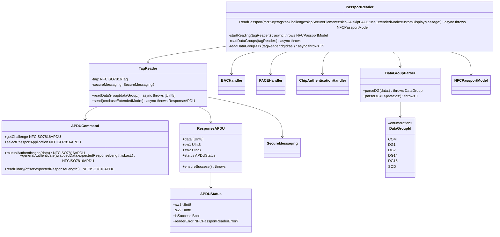
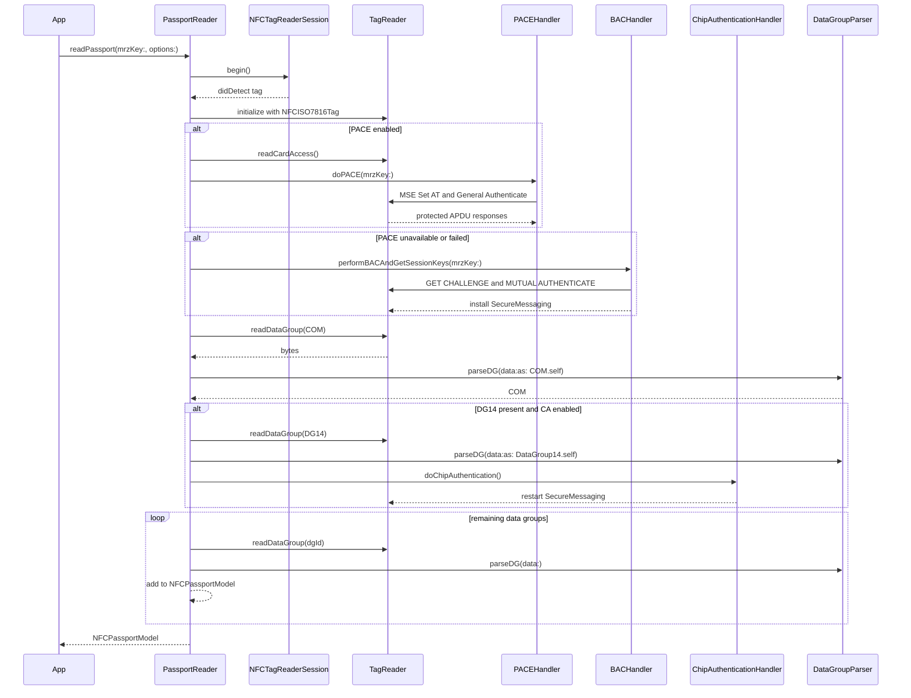
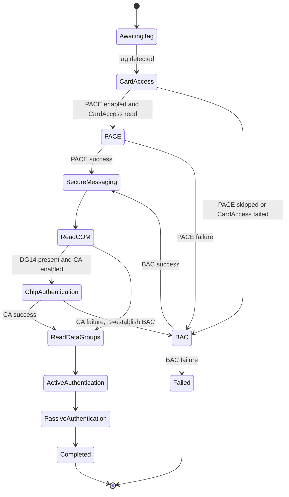

# NFCPassportReader Architecture

This package is being moved away from a direct Android-style port toward a Swift package shape with explicit protocol boundaries, small testable primitives, and clear ownership of NFC state. The `deluca` port is useful as a structural reference, especially around APDU, data-group, security, and documentation organization. It is not the behavioral source of truth for PACE or Chip Authentication because that implementation is incomplete there.

## Critical Review

The original package has several production risks:

- `TagReader` mixed APDU construction, secure messaging, transport, GET RESPONSE continuation, status-word decoding, and file reading.
- APDU failures were stringly typed and decoded in a private method, which made retry logic rely on exact English messages.
- `DataGroupParser` used parallel arrays for tags, display names, and concrete classes. That is fragile because a single ordering bug changes parser behavior.
- `PassportReader` owns NFC session state, authentication state, reading policy, retry policy, and model mutation. This is workable but too large for confident changes.
- The SwiftPM test target did not depend on the library target, so the package test scheme could not import `NFCPassportReader`.
- `swift test` on macOS is still not a valid verification command for this package because the source and tests import iOS-only CoreNFC APIs.

## Current Refactor

This pass keeps the public API and the existing PACE/Chip Authentication behavior intact while extracting Swift-native seams:

- `APDUCommand` centralizes APDU construction as typed factory methods.
- `APDUStatus` centralizes status-word interpretation and fixes success detection so both `0x90` and `0x00` are required.
- `ResponseAPDU.ensureSuccess()` gives callers a single, testable success gate.
- `DataGroupParser` now uses a typed registry keyed by `DataGroupId`.
- `DataGroupParser.parseDG(data:as:)` provides a generic concrete decoder and removes avoidable downcasts at call sites.
- `Package.swift` now makes `NFCPassportReaderTests` depend on `NFCPassportReader`, so the iOS test scheme is buildable.

## Package Class Diagram

## Read Sequence

## Authentication State

## Deluca Reference Decisions

Adopted:

- APDU command factories instead of constructing APDUs inline.
- APDU response/status decoding as a first-class concept.
- Data-group decoding registry instead of parallel arrays as the primary parser mechanism.
- Package documentation as part of the source tree.

Not adopted:

- Replacing the current PACE and Chip Authentication implementations, because the `deluca` versions are not complete for the flows this package already supports.
- Removing recovery behavior around CA failure, BAC re-establishment, GET RESPONSE, and data-length fallback.

## Test Strategy

The iOS simulator test scheme now covers:

- APDU command construction for selected commands.
- APDU success/error mapping, including the fixed `0x90 0x01` non-success case.
- Invalid MRZ status mapping.
- Generic data-group parsing success and type-mismatch failure.
- Existing ASN.1, crypto, secure messaging, and data-group parser coverage.

Recommended next coverage:

- A fake `NFCISO7816Tag` adapter so `TagReader` file reading, GET RESPONSE continuation, and retry behavior can be tested without hardware.
- Golden-vector tests for PACE General Mapping and Chip Authentication command sequencing.
- Fixture-based SOD/passive authentication verification.
- Coverage reporting in CI through `xcodebuild test -enableCodeCoverage YES`.
